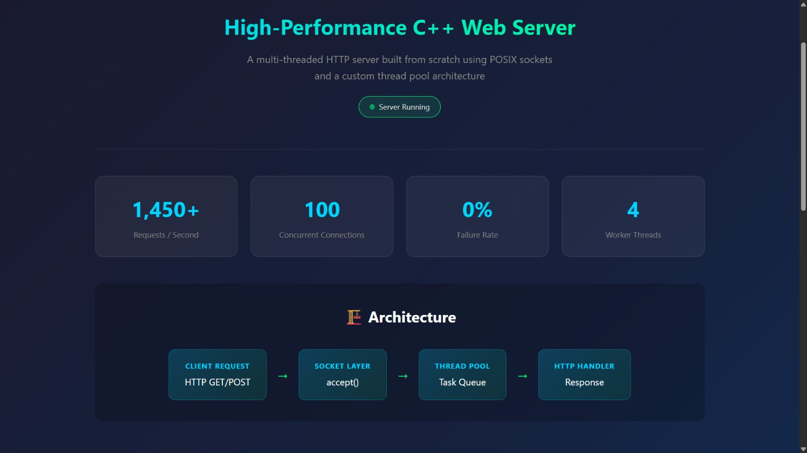

# ⚡ High-Performance Multi-Threaded Web Server (C++)

A lightweight, high-throughput HTTP web server built from scratch using **C++17** and **POSIX Sockets**. 

Designed to demonstrate systems programming concepts including **Thread Pools**, **Mutex Locking**, **Condition Variables**, and **RAII Resource Management**. Capable of handling **2,200+ concurrent requests per second** with sub-millisecond latency.

 
*(Replace 'webp.jpeg' with your actual landing page screenshot filename if different)*

---

## 🚀 Performance Benchmarks

Tested using **Apache Benchmark (ab)** on standard consumer hardware (Performance Mode active).

| Metric | Result |
| :--- | :--- |
| **Throughput** | **2,288 Requests / sec** |
| **Latency per Request** | **0.437 ms** (mean) |
| **Concurrent Users** | 100 |
| **Failed Requests** | 0 (0% Error Rate) |

> **Note:** The server outperforms basic single-threaded implementations by leveraging a pre-allocated thread pool, reducing CPU context switching overhead significantly.


*(Replace 'ab_bench.jpeg' with your actual benchmark screenshot)*

---

## 🛠️ Key Features

* **🧵 Custom Thread Pool:** Pre-allocated worker threads (`std::thread`) that sleep when idle and wake up via `std::condition_variable` only when tasks arrive. Zero busy-waiting.
* **🔒 Thread Safety:** Uses `std::mutex` and `std::unique_lock` to ensure safe access to the shared task queue.
* **🔌 POSIX Networking:** Built directly on low-level Linux socket APIs (`socket`, `bind`, `listen`, `accept`).
* **🛡️ Security First:** Custom middleware prevents **Directory Traversal Attacks** (e.g., `../../etc/passwd`) by sanitizing input paths.
* **📂 Static File Serving:** Efficiently serves HTML, CSS, JS, and image files with automatic MIME type detection.
* **♻️ RAII Design:** Sockets and threads are automatically managed and cleaned up, preventing memory leaks and zombie processes.

---

## 🏗️ Architecture

The server moves away from the inefficient "Thread-Per-Client" model and uses a **Producer-Consumer** pattern:

1.  **Main Thread (Producer):** Listens on Port 8080. Accepts new connections (`accept()`) and pushes the client socket into a `ThreadSafeQueue`.
2.  **Worker Threads (Consumers):** 4 constant threads wait for the queue to perform a task.
3.  **Synchronization:** A `condition_variable` wakes up exactly one worker when a new connection arrives.
4.  **Processing:** The worker reads the request, determines the file path, checks for security violations, and sends the HTTP response.

```mermaid
graph LR
    A[Client Request] -->|Port 8080| B(Main Thread)
    B -->|Push Task| C{Task Queue}
    C -->|Notify| D[Worker Thread 1]
    C -->|Notify| E[Worker Thread 2]
    C -->|Notify| F[Worker Thread 3]
    C -->|Notify| G[Worker Thread 4]
    D -->|HTTP Response| A